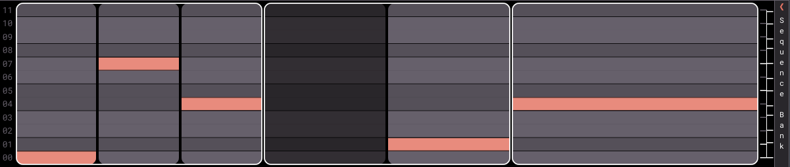
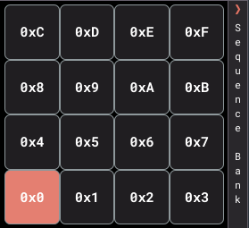

# XenSequencer User Guide

## DAW Setup

Buckle up, this is the most complicated part of the process. XenSequencer is a VST plugin that works with MIDI and support across DAWs is varied. The following are some general steps to get the plugin up and running in your DAW:

- Add XenSequencer to a MIDI track in your DAW.
- Route the MIDI output from XenSequencer to a MIDI instrument.
   - If you're lucky enough to have a DAW that supports MIDI plugins directly, it can be placed inline with the instrument on the same track.
   - Otherwise the instrument will need to be on a separate track, and the MIDI output from XenSequencer can be routed to the instrument's input.
- Enable MPE support if offered by your DAW (For non-standard tunings).

### Ableton
- Needs separate tracks for XenSequencer and instrument.
- Instrument track needs input from XenSequencer track, and to have monitoring set to 'In'.
- Right click on the XenSequencer plugin box and enable MPE.

### Bitwig
- Can be placed inline with the instrument on the same track.
- MPE button is available when plugin is selected, but have yet to get pitch bend data to work.

## Brief Tutorial

Set up an instance of the plugin along with a synth as detailed above. Create a new MIDI clip in your DAW to feed into the XenSequencer instance with the C1 note held for a measure. Loop it.

Open the plugin and you'll see a blank timeline. Click on the middle element of the sequencer to give it focus, then press the colon key `:` to open the command bar at the bottom. Type 'note' and press enter. This will fill the sequence with a single note of pitch '0'. Press play, you should hear an A4 playing in your synth.

Modify the note's parameters:
- Press `p` to enter __pitch input mode__. Use the up and down arrows to change the pitch.
- Press `v` to enter __velocity input mode__, and change the velocity.
- Press `d` to enter __delay input mode__, and change the delay.
- Press `g` to enter __gate input mode__, and change the gate.

If you change the pitch beyond an octave boundary, you'll notice the note wraps around the edge, back to the bottom or top, with an icon to denote the octave number.

Press `s` to split the current note into two notes. This is the main mechanism to create more notes. Now both notes are selected, press `p` to enter pitch input mode and change the pitch of both notes at once.

The `s` keybinding can also take a number parameter, you do this by first typing out the number, and then hitting the `s` key. This number will determine the number of divisions for the split. Be careful with large numbers.

Press `Shift` and the down arrow to 'drop down' one layer into the sequence. This will allow you to select individual notes that were created by the split. Press `Shift` and the up arrow to move back up a layer. This is the recursive nature of the sequencer, every level operates the same as the one above it and is a complete sequence itself.

Try copy and pasting any selection with the common `ctrl+c` and `ctrl+v` keybindings. You'll notice that copying a sequence and pasting it into a shorter or longer selection will stretch or compress the sequence to fit the new length. This copy and paste buffer works across instances as well, allowing you to share sequences amongst instances of the plugin.

Open the __Sequence Bank__ by clicking on the arrow icon at the top right. You will see 16 available sequences. Click on the `0x1` square to select that sequence, then create a new sequence. Go back to your DAW track and add the C# note just above the previous C note. The new sequence should start playing back along with the original.

From here try the __Library__ view by pressing `w`. This will show you the saved sequences, tunings, and scales. You can load a new scale or tuning by clicking on it. Be warned that these scales only make sense for a subset of 12 note tunings.

Check out the [command reference](command_reference.md) and the [keybindings reference](keybindings_reference.md) for more ideas.

## Scales
The current scale defines a subset of notes available. Any notes outside of this set will be transposed to the next valid note in the current translate direction. The easiest way to change scales is to enter the __scale input mode__ with the `c` key and cycle through the available scales with the arrow keys.

The __Scale Mode__ shifts the scale's interval pattern by some amount. For example, a major scale has the interval pattern `[2, 2, 1, 2, 2, 2, 1]`. If the scale mode is set to `3`, then the scale will start on the third note of the major scale, `[1, 2, 2, 2, 1, 2, 2]`. This can be cycled through by entering __scale mode input mode__ with the `m` key, then the arrow keys to cycle the mode.

## Commands

Commands are entered into the command bar at the bottom of the plugin window. The command bar will autocomplete commands and arguments as you type. Press the up and down arrows to cycle through the command history, and press `tab` to autocomplete any shown guide text. Some commands have default arguments that are used if no value is provided, these defaults are displayed in the guide text. The `Enter` key will execute the typed command.
Multiple commands can be run at once by separating them with a semicolon `;`.

The `again` command will repeat the previous command and has the `.` keybinding.

Commands can be bound to keyboard shortcuts in the `user_keys.yml` file in the user data directory:
- Windows: `\Users\username\AppData\Roaming\XenSequencer\`
- MacOS: `~/Library/XenSequencer/`
- Linux: `~/.config/XenSequencer/`

### Patterns

Some commands take a `Pattern` as an argument. Patterns have the following format: `[offset] intervals...` where `offset` is optional. `offset` is defined by putting a plus sign followed immediately by an integer. `intervals...` is a space separated list of integers. A pattern changes the selection of notes in the current sequence to run the command against. If no pattern is provided, the entire selection will be used.

The `offset` is used to shift the pattern to the right by the given number of steps. For example, `+1` will apply the command to everything except the first cell. `+1 2` will skip the first cell, then skip every other cell after that. `2 3` will apply to the first, third, sixth, eighth, etc... An iterval cannot be less than one. The default Pattern, when one is not provided, is `+0 1`.

The command reference can be found [here](command_reference.md).

## Sequence Bank
Contains 16 monophonic sequences, each activated by a different MIDI note (starting at `C1`). Can be played simultaneously, up to 15 note polyphony. Shift the current selection with the `Ctrl` + `Shift` + `Arrow` keys.

## Top Bar
Along the top of the plugin window you'll find a listing of some settings, these are all editable by double clicking and typing unless otherwise noted.

| Element | Description |
| ------- | ----------- |
| Time Signature | The time signature of the current sequence in view. |
| Zero Frequency | The frequency in Hertz of the zero-th pitch. |
| Key | A transposition parameter, applied to all notes, only useful for EDO tunings. |
| Scale | The scale applied to all notes. |
| Scale Mode | The mode of the scale, if any; range of [1, scale size]. |
| Tuning | The current tuning name, not editable. |
| Sequence Name | The current sequence index and name. |

## Library
Press `w` to toggle the Library view. This view contains the following sections:
- Saved Sequences
- Tunings
- Scales
